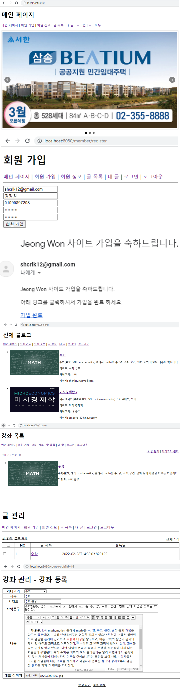
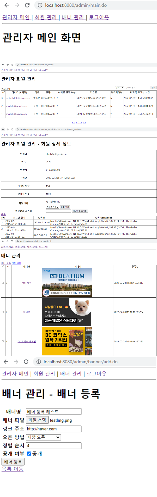

# 나만의 블로그
## 개요
블로그 기능을 개발하며 필요한 기술들을 학습하기 위해 개발을 진행하였음.

## 기술 스택
### Backend
* Spring boot, Mysql, Spring security, JPA
### Frontend
* Timeleaf, html, css, javascript

## 구현 내용
### 일반 유저
* 로그인, 로그아웃
* 회원 가입
    * 회원 가입 시, 이메일로 아이디 활성화 메일 전송
* Banner 광고 노출
    * 클릭 시, 광고 페이지로 이동
* 글 작성
    * 제목, 카테고리, 키워드, 내용 작성
* 내 글 조회 및 삭제

### 관리자
* 회원 관리
    * 가입한 회원의 정보 열람
* 배너 관리
    * 광고 게시일, 표시일

## Page
* ### 일반 유저

* ### 관리자
